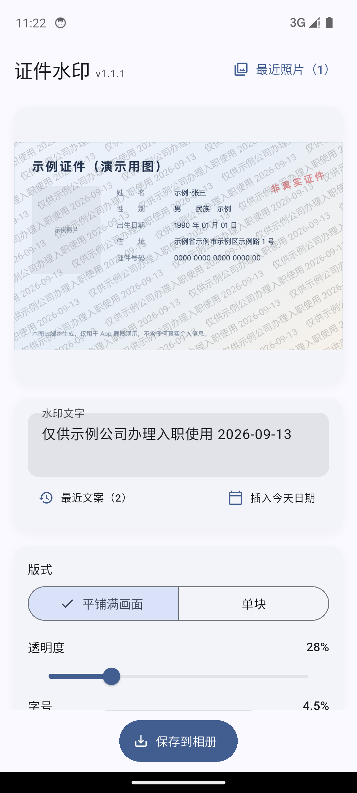
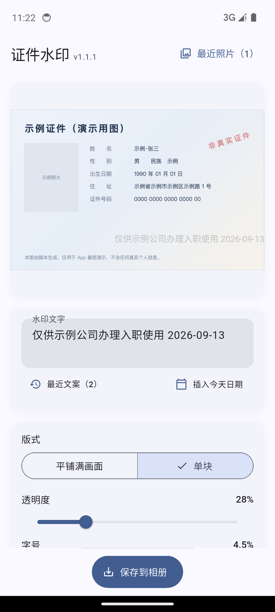
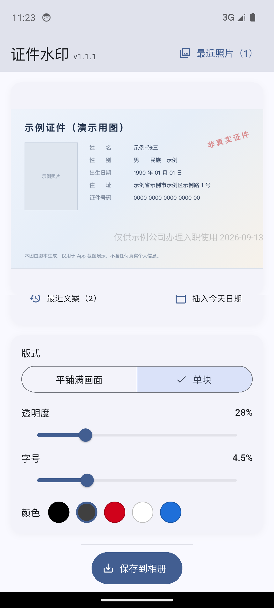
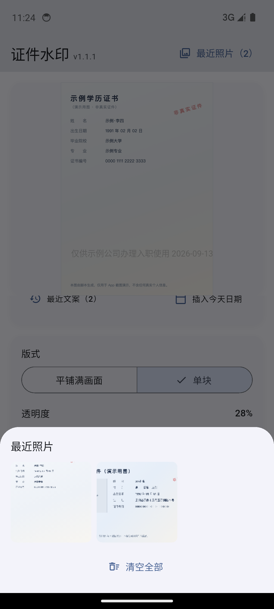
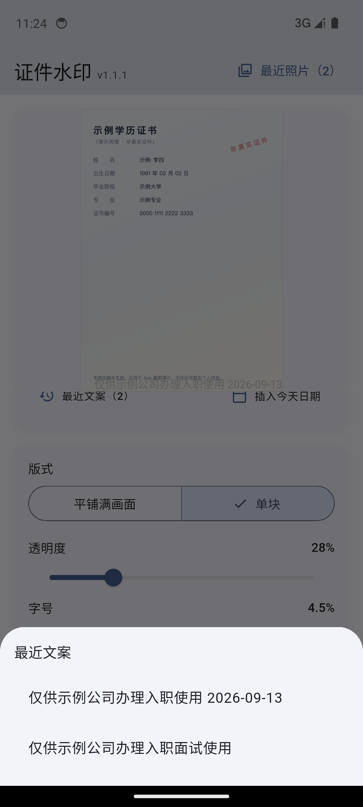

# 证件水印 · IDMask

给证件照片叠一行自定义文字水印的 Android / iOS App。

线上提交身份证、学历证、户口本这类证件照片之前，先用它叠上一句
「仅供某某公司办理入职使用 2026-09-12」。照片即使外流，也难再被当作无标注的原件挪作他用。

**100% 离线 · 无账号 · 无后端 · 不申请任何系统权限 · 无广告**

## 界面

<p align="center">
  
  
  
</p>
<p align="center">
  
  
</p>

> 从左到右、从上到下：平铺水印效果 / 单块水印拖到一角 / 版式与样式调整 / 最近照片 / 最近文案。
> 截图取自模拟器上运行的 release 版；照片是脚本生成的**示例证件**，不含任何真实个人信息。


## 功能

主流程只有四步：**选图 → 输文案 → 实时预览 → 保存到相册**。

### 选图

- 点预览区唤起系统相册，没有单独的「从相册选照片」按钮
- 标题栏的「最近照片（N）」可一键选回用过的照片：缩略图列表，最多留 10 张，
  长按删除单张、底部一键清空；同一张照片按内容指纹去重，不会堆出多条

### 文案

- 自己写整段文字，没有模板句式、没有模式切换
- 输入框旁的「插入今天日期」把 `YYYY-MM-DD` 插到光标处（输入框未聚焦时追加到末尾）
- 水印只有一行：粘贴多行文本时，换行会折叠成空格
- 最近用过的 10 条文案可一键复用

### 版式与位置

| 版式 | 说明 |
|---|---|
| **平铺满画面**（默认） | 文字斜向重复铺满整张图，难以靠裁剪或局部涂抹去除 |
| **单块** | 一段文字，默认居中，可用手指直接拖到想要的位置 |

- 两种版式都能在预览上直接拖动：单块拖的是文字本身，平铺拖的是整层网格的偏移
- 拖动跟手移动、不做吸附；拖到边缘会夹住，水印文字始终完整可见
- 拖动时显示十字参考线（穿过水印中心），松手后隐藏
- 位置与偏移会被记住：切换版式再切回来、重启 App 后仍在

### 样式

三项可调，都在主编辑页的同一个样式区里：

| 项 | 范围 | 默认 |
|---|---|---|
| 透明度 | 5% – 100% | 28% |
| 字号 | 图片短边的 2% – 12% | 4.5% |
| 颜色 | 预设色板：黑 / 深灰 / 红 / 白 / 蓝 | 深灰 `#404040` |

字号按**图片短边的比例**计算，同一设置在低分辨率与高分辨率照片上观感一致；布局与绘制代码在预览和
成品图之间共用，所见即所得由结构保证。

### 保存

- 成品以 JPEG（质量 92）**另存**到系统相册，**原图保持不动**
- 产物丢弃拍摄时间、GPS 等 EXIF 信息 —— 对证件照而言更安全
- 保存成功或失败都有明确提示；文案为空时保存按钮置灰

## 隐私设计

- **不申请任何系统权限**。构建产物中没有 `INTERNET` 权限，程序物理上无法联网
- 无账号、无登录、无后端、无广告、无第三方统计 SDK
- 照片与水印全部在本机处理，任何数据都不出设备
- 「最近照片」的副本写在 App 私有目录 `idmask_photos/`，其他 App 读不到，卸载即删；
  在 iOS 上该目录已**排除 iCloud 备份**

## 平台与依赖

- Flutter 3.47.2，Dart SDK `^3.13.2`；Android（`minSdk 24` / `targetSdk 36`）与 iOS
- 运行时依赖只有这些：`image_picker`、`gal`、`shared_preferences`、`path_provider`、
  `path`、`provider`、`package_info_plus`、`cupertino_icons`

## 开发

命令都在仓库根目录执行。`pub get` / `test` / `build` 需要代理：

```bash
export ALL_PROXY=socks5://127.0.0.1:7890
export HTTPS_PROXY=socks5://127.0.0.1:7890
export HTTP_PROXY=socks5://127.0.0.1:7890
```

```bash
flutter pub get
flutter run
flutter analyze
flutter test
flutter build apk --release
flutter build ios --simulator
```

## 代码结构

```
lib/
├── pages/       主编辑页（App 只有这一个页面）
├── providers/   WatermarkProvider —— 唯一的应用状态
├── services/    布局、绘制、渲染、存储（尽量做成纯逻辑，便于测试）
├── widgets/     预览画布、拖动层、样式控件、最近照片与最近文案两个列表
└── models/      水印样式、绘制指令等数据模型
```

布局与绘制是分开的：`WatermarkLayout.compute(...)` 是纯函数，把「画布尺寸 + 文案 + 样式」算成
一组绘制指令，预览与成品图调用的是**同一个** `compute` 和**同一个** `WatermarkPainter.paint`，
区别只有画布尺寸。字号按图片短边比例、单块位置用归一化坐标，所以两者等比，所见即所得由结构保证。

## 测试

`test/` 下按被测对象分文件，覆盖布局算法与文案、指纹、存储等纯逻辑，以及主编辑页的 widget 测试：

```bash
flutter test
```

相册读写、平台通道编码、权限弹窗、大图内存表现、拖动手感、iCloud 备份排除等真机相关事项靠手测，
清单见设计文档第 12.2 节。

## 文档

| 文档 | 内容 |
|---|---|
| `docs/superpowers/specs/2026-09-12-idmask-design.md` | 设计文档，行为相关改动的唯一事实来源 |
| `docs/superpowers/plans/2026-09-12-idmask.md` | 实施计划 |
| `docs/huawei/privacy-policy.html` | 隐私政策（经 GitHub Pages 发布） |
| `AGENTS.md` / `CLAUDE.md` | 面向 AI Agent 的仓库约定 |

> 应用商店上架材料（市场文案、上架操作手册、截图）保留在本地 `docs/huawei/`，不纳入版本控制。
